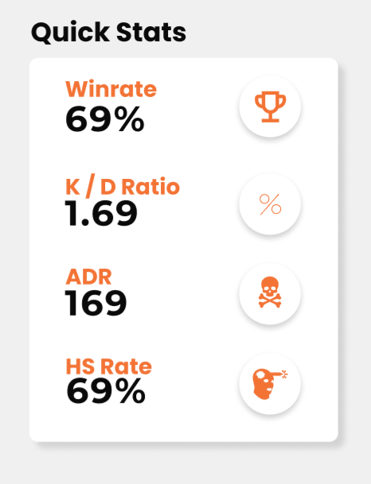

# /api/quickStats/{steamID64}

We know Steam Community profile link without custom URL looks like `https://steamcommunity.com/profiles/76561198893083379` and in this end point `steam_id_64` = `76561198893083379` from the previous mentioned URL example.

### Example Response

```json
{
  "winrate": 45.289855072463766,
  "kdRatio": 1.243516671416358,
  "adr": 156.6450172668969,
  "hsRate": 51.97204079294144
}
```

### Response explaination

**winrate**

- Number of winning out of total played matches.

**kdRatio**

- Kill over Death ratio.

**adr**

- Average Damage per round.

**hsRate**

- Headshot kills out of total kills.

### Example use on the client


