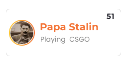

# /api/userSteamDetails

### `1. /api/userSteamDetails/id/{profile_custom_url}`

We know Steam Community profile link with custom URL looks like `https://steamcommunity.com/id/stonecoldman` and in this end point `profile_custom_url` = `stonecoldman` from the previous mentioned URL example.

### `2. /api/userSteamDetails/profiles/{steam_id_64}`

We know Steam Community profile link without custom URL looks like `https://steamcommunity.com/profiles/76561198893083379` and in this end point `steam_id_64` = `76561198893083379` from the previous mentioned URL example.

### Example Response

```json
{
  "name": "Papa Stalin",
  "steamID64": "76561198893083379",
  "steamLevel": 51,
  "avatarImageURL": "https://steamcdn-a.akamaihd.net/steamcommunity/public/images/avatars/63/630df3a759d8a2e56d1141138fac4ce20f26f347_full.jpg",
  "onlineStatus": 1,
  "playingGame": "Counter-Strike: Global Offensive"
}
```

### Response explaination

**name**

- Steam profile name

**steamID64**

- SteamID64 of the profile

**steam_level**

- Steam profile level

**avatar_image_url**

- User's steam profile avatar image at 184x184px resolution

**online_status**

- The user's current status. 0 - Offline, 1 - Online, 2 - Busy, 3 - Away, 4 - Snooze, 5 - looking to trade, 6 - looking to play. If the player's profile is private, this will always be "0", except if the user has set their status to looking to trade or looking to play, because a bug makes those status appear even if the profile is private. (source: STEAM_WEB_API).

**playing_game**

- The name of the game the user is currently playing on steam.

  **NOTE: This data is not available for private profiles**

### Example use on the client


